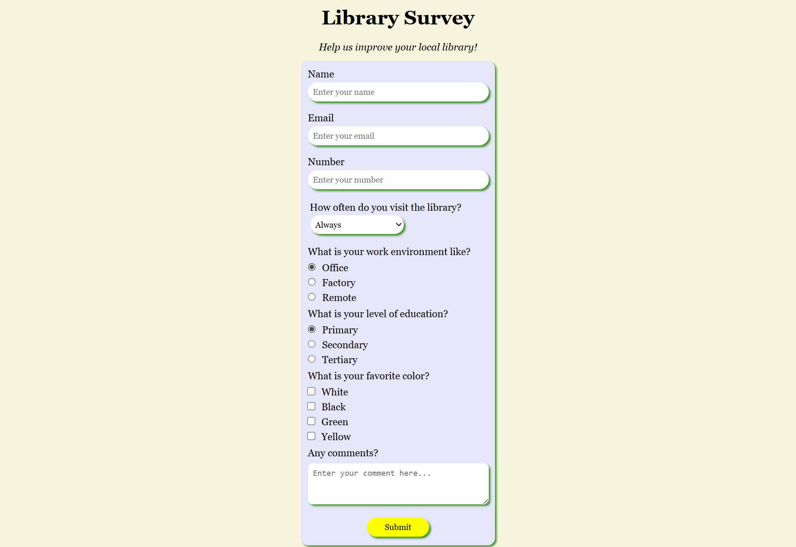

# 📚 Library Survey Form

A clean, responsive survey form built with **HTML** and **CSS** — designed to collect community feedback for a local library.



---

## 🔍 Overview

This project is a static web form that captures visitor information and preferences through various input types. It was built as a front-end practice project focused on form structure, styling consistency, and user experience.

---

## ✨ Features

- **Text inputs** — Name, Email, and Phone Number fields
- **Dropdown select** — Frequency of library visits (Always, Often, Sometimes, Rarely)
- **Radio buttons** — Work environment and education level selection
- **Checkboxes** — Favourite colour multi-select
- **Textarea** — Open-ended comments field
- **Styled submit button** — High-contrast yellow CTA button

---

## 🎨 Design Highlights

- Soft **cream background** (`#f5f5dc`) for a warm, welcoming feel
- **Lavender/periwinkle card** container for the form panel
- **Pill-shaped inputs** with rounded borders and green focus accents
- Clean **serif typography** for headings, sans-serif for body
- Fully built with **vanilla CSS** — no frameworks or libraries

---

## 🗂️ Project Structure

```
library-survey/
├── index.html       # Main HTML structure
├── style.css        # All custom styles
└── README.md        # Project documentation
```

---

## 🚀 Getting Started

1. **Clone the repository**
   ```bash
   git clone https://github.com/Danbaba1/library-survey.git
   ```

2. **Navigate into the folder**
   ```bash
   cd library-survey
   ```

3. **Open in your browser**
   ```bash
   open index.html
   ```
   Or use a live server extension (e.g. VS Code Live Server) for hot reload.

---

## 🛠️ Built With

- HTML5
- CSS3

---

## 📸 Demo

https://github.com/Danbaba1/Library-Form/releases/download/image/demo.mp4

---

## 📄 License

This project is open source and available under the [MIT License](LICENSE).

---

## 🙋‍♂️ Author

**Your Name**  
[GitHub](https://github.com/Danbaba1) • [LinkedIn](https://linkedin.com/in/daniel-oladepo)
